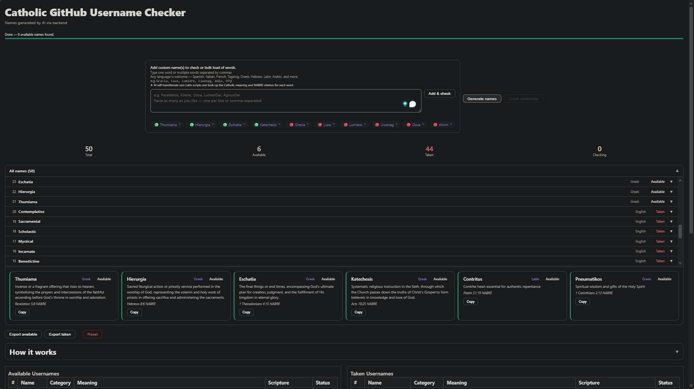

# refinemyusername
### ✝ Catholic GitHub Username Checker


**[→ Try it live](https://aimeelramirez.github.io/refinemyusername/)**

A full-stack tool that generates meaningful, scripture-grounded GitHub usernames from the Catholic theological tradition — and verifies their availability in real time. Instead of `dev_final_v3`, claim something that actually says who you are: `Thumiama`, `Hierurgia`, `Pneumatikos`.


 - Art was created by me.
---

## What It Does

The tool is an **AI-assisted decision accelerator**. Finding a theologically sound, GitHub-valid, actually-available username manually means cross-referencing lexicons, concordances, transliteration tables, and GitHub's signup page — an afternoon's work. This collapses it into under a minute.

Every name the AI returns carries **descriptive weight** — it is not just a string but a posture. When `Contritus` arrives annotated with *contrite heart, essential for authentic repentance — Psalm 51:19 NABRE*, you are not choosing between labels. You are choosing between statements. Decision time drops because the cognitive load shifts from analytical to intuitive.

Submit your own words too. Type `Ruach` and the enrichment engine doesn't just define it — it opens the entire pneumatological field: `Pneuma`, `Spiritus`, `Roh`. One keyword becomes a whole doctrinal neighborhood to explore.

---

## Features

| | |
|---|---|
| **AI Generation** | Produces batches of faith-inspired names with meaning, language category, and NABRE citation — never repeating names across sessions |
| **Availability Check** | Verifies each name live against GitHub's registry; 300 ms delay between calls to avoid rate limiting |
| **Multilingual Input** | Accepts Greek, Hebrew, Cyrillic, Latin diacritics, CamelCase compounds — auto-transliterates to GitHub-valid strings |
| **AI Enrichment** | Manually submitted words get the same meaning + citation treatment as generated names, in batches of 10 |
| **Status Tracking** | Every name moves through: 🟡 Pending → 🔵 Checking → 🟢 Available / 🔴 Taken / ⚪ Unknown |
| **CSV Export** | Export available and taken lists separately — client-side, no server round-trip, includes name, category, meaning, scripture, status |
| **Keyword Gap Analysis** | Taken names signal concepts already colonized by secular accounts; the avoidance list pushes AI toward less-charted theological territory each session |
| **Session Memory** | `usedNames` set prevents duplicates across multiple generation passes |
| **Preloaded History** | Prior session CSVs render as tables on page load — no need to re-run |

---

## Architecture

```
Browser (Vanilla JS · no build step · no dependencies)
    │
    ├── POST /model   → FastAPI → Claude AI   (generation & enrichment)
    ├── GET  /check   → FastAPI → GitHub      (availability)
    └── GET  /csv     → FastAPI → Stored CSVs (history on load)

Frontend: GitHub Pages  ·  Backend: Heroku
```

---

## Theological Vocabulary

| Language | Examples | Tradition |
|----------|----------|-----------|
| Greek | Eschatia, Hierurgia, Pneumatikos | Eastern liturgical theology |
| Latin | Contritus, Gratia, Pax, Fides | Roman Rite & scholasticism |
| Hebrew | Emeth, Chesed, Ruach, Shalom | Old Testament covenant |
| Tagalog | Liwanag, Pag-asa | Filipino Catholic devotion |
| Spanish / French / Italian | Gracia, Lumière, Luce | Romance vernaculars |
| English | Contemplative, Mystical, Sacramental | Anglo-Catholic theology |

Each name arrives with a NABRE citation — not as decoration, but as witness.

---

*Ora et Labora.* — St. Benedict · MIT License